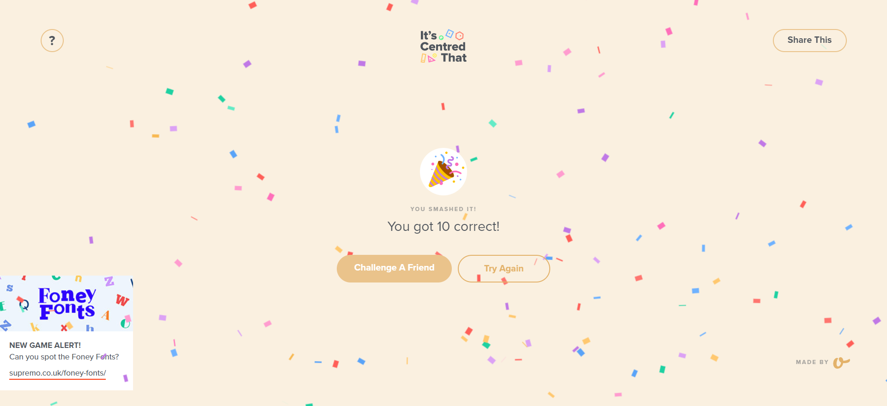

<h3 align=center> Hello there, my fellow Alfbuddy! 💖</h3>

 
    

<h2 align=center> 🚀 UI and UX analyses for Day 1 🚀</h2> 

&nbsp;&nbsp;&nbsp;&nbsp;**User-Experience Analysis:** 

- <b>Which website is easier to find the product you are looking for? 
    Answer:</b> Personally, I find Shopee easier to navigate and operate since I have been using it ever since I started online shopping.

- <b>Identify any distractions or unnecessary elements that could potentially confuse users. 
    Answer:</b> In both shopping sites, I would consider the pop-up advertisements as distractions, especially those that contain false exit buttons to redirect users to another link. For Lazada, I find its categories section confusing since the items in this area are more randomly categorized compared to Shopee’s way of grouping its products. Another would be the alignment of media elements in Lazada’s platform, which varies on the provided product pictures, unlike in Shopee which is equally aligned to the product alongside it.

- <b>Compare the organization of content between the two platforms. Which between the two platforms’ content is easier to scan and understand? 
    Answer:</b> I think both platforms are still easy to scan and understand, but once again, I prefer Shopee for content alignment and organization as I find it clearer to understand both visually and in writing. 

  &nbsp;&nbsp;&nbsp;&nbsp;**User-Interface Analysis:**

-   <b>Is the websites’ layout and design visually pleasing and consistent with their brand? 
    Answer:</b> I believe both websites’ layouts and designs are almost similar, only varying in color, amount of text, and element organization. I do think it is consistent with their brand’s purpose and attractive to the eye, although sometimes it can appear to be too overcrowded for me that I refuse to use it for a while.
    
-   <b>Comment on the responsiveness of both websites across different devices. 
    Answer:</b> All clickable elements in both websites have fast responsiveness and navigate to their corresponding contents. 
    
-   <b>Which do you think is better when it comes to the visual aspect of the website? 
    Answer:</b> In my opinion, I think Shopee’s overall visual aspect is better than Lazada’s. 
    
     

#### 2. An **optional** screenshot of playing the game **"It's Centred That"** and your feedback

     

🚀✨

