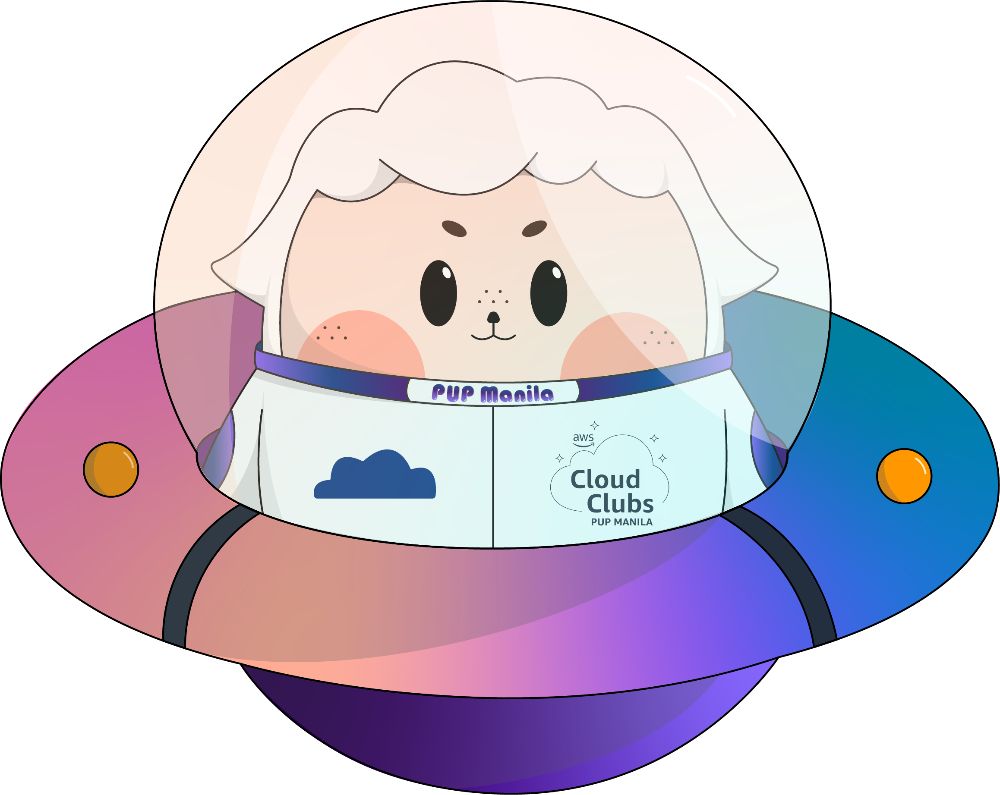
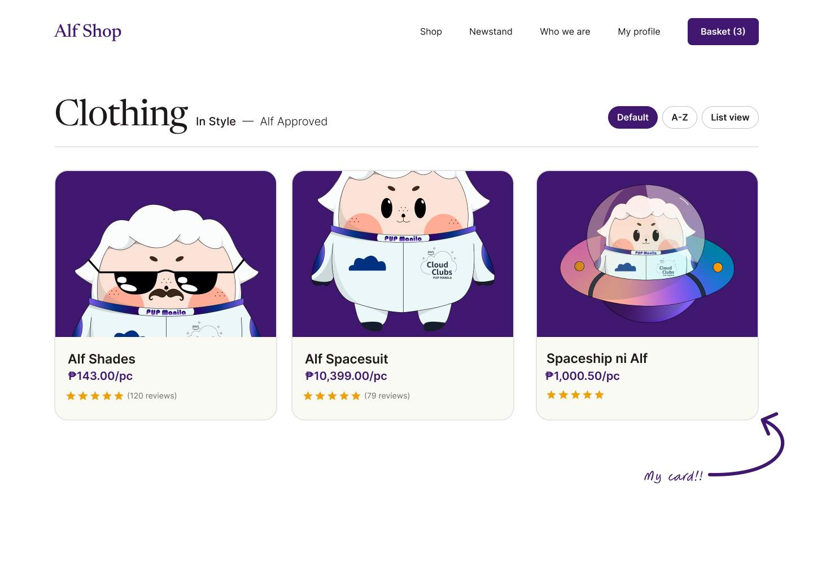

<h3 align=center> Hello there, my fellow Alfbuddy! 💖</h3>

 
    

<h2 align=center> 🚀 Figma Basics Day 2 🚀</h2> 

<b>Here's my Figma Tutorial Link:</b>

https://www.figma.com/file/Ay4h1jlU2mjsUIbYpAEX1j/AWSCC-Figma-Workshop%3A-Basics-(Community)?type=design&node-id=0%3A1&mode=design&t=l7dejJCbuSv6Doxq-1

<b>What can you say about your Figma tutorial experience?</b>
- I found the provided tutorial easy to follow and very engaging with the practice challenge after each topic. I had fun exploring Figma's controls, tools, and interface :D

<h3 align=center>✨Card Activity Result✨</h3>

     

