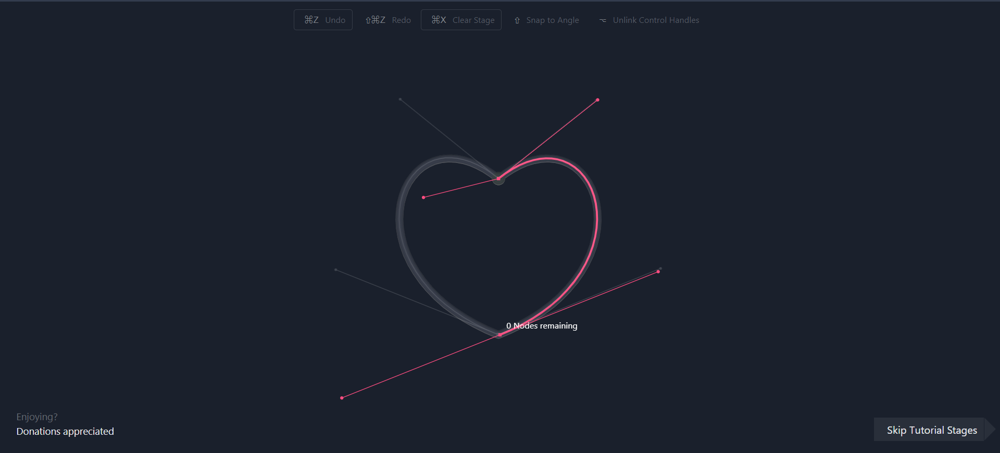
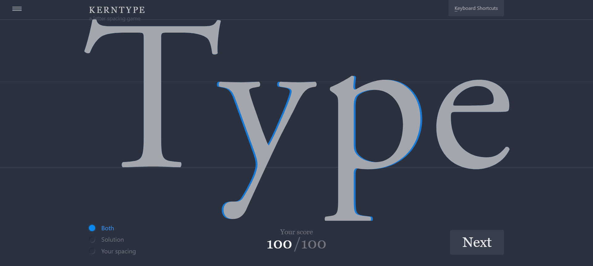
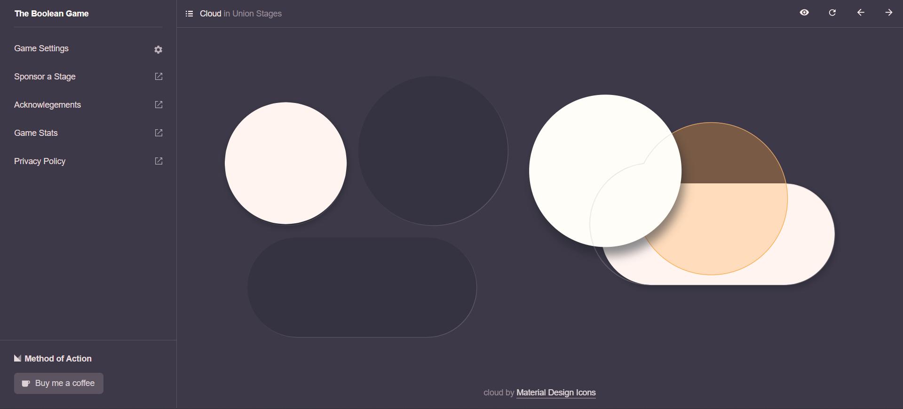

<h3 align=center> Hello there, my fellow Alfbuddy! 💖</h3>

 
    

<h2 align=center> 🚀 D-5: Figma Tutorial (Advance) 🚀</h2> 

<b> Link for Figma D-5 Activity:</b>

https://www.figma.com/file/gJN3ni851VRdQPVcb7NVZ7/AWSCC-Figma-Workshop%3A-Advance-(Community)?type=design&node-id=0%3A1&mode=design&t=iRohZVcYUGKeqiJx-1

<b> What can you say about this Figma Workshop?</b>

- I had fun exploring the different Figma tools and attempting the practice activities. The pen tool and auto layout feature was two of my favorites for this activity. At some point, I did confuse myself with the grids and constraints part, but I think I was able to do it  ^_^

<h2 align=center>✨Photo Point: Game Time✨</h2>

<b>Game 1: The Bézier Game -------------------------------</b>

    

<b>Game 2: Kern Type ---------------------------------</b>

    

<b>Game 3: The Boolean Game --------------------------------</b>

    

